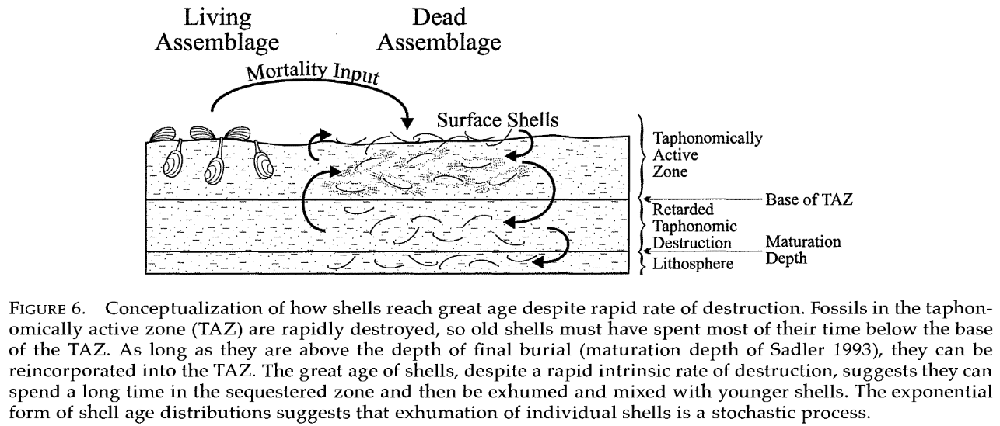

# Activity 1—Constructing the Fossil Record: Living Communities, Dead Shells, and Time-Averaging

The fossil record allows us to reconstruct life of Earth’s ancient past. However, the fossil is not a perfect biological archive: some information is missing, while other biological aspects may be over-represented. Nevertheless, the aspiring paleontologist should not be daunted. We actually know quite a lot about how living organisms become fossils--this subfield of paleontology is called **_taphonomy_**. With an understanding of taphonomy, paleontologists can properly interpret the biology of fossil assemblages.

This exercise will have you to explore some aspects of how living communities become fossil assemblages. One of the questions paleontologist want to know is what species were present and in what abundance at a particular location and during a specific interval of geological time. You will learn some basic taphonomic principles here to allow you to answer one of these most basic of paleontological questions.

As you learned in the online lectures, time-averaging is the mixing of individuals in a fossil or death assemblage that did not actually live at the same time. Time averaging  typically increases species richness (the number of species present) in a death assemblage relative to the corresponding life assemblage from that location. Time-averaging also makes death assemblages from different locations look more similar to each other than the life assemblages actually are.

This exercise will be based upon a ‘shiny app’, which is a dynamic website built using the statistical programming language [R](http://r-project.org). For this exercise you will use the *Taphonomy* shiny app, which you will need to launch using R or RStudio by running the following two lines\*:

```` r
library(shiny)
runGitHub("shinypaleo", "naheim", subdir="taphonomy")

````

\* *If you don't have the shiny package already installed, you will first need to run:* ``install.packages("shiny")``*. You will only need to run this command once.*

Executing the above code in the R console or RStudio will open a browser window. The app web page has three tabs, which will correspond to Parts 1, 2, and 3 below.


## Part 1: Live-Dead Data

This tab displays what is typically called 'live-dead' data. They are called this because they are composed of samples containing both living and dead individuals. Of course, the only species that accumulate dead individuals with any abundance are those with hard skeletons. For this exercise, we are focusing on bivalve and gastropod mollusks (clams & snails, respectively) from coastal waters of Southern California.

The data presented in the 'Live-Dead Data' tab were compiled by John Warme in the 1960s for his PhD dissertation. The samples were collected in Mugu Lagoon, which is a small back-barrier lagoon in Ventura County California (between Santa Barbara and Los Angeles). Warme collected 45 samples within Mugu lagoon (see map at bottom of app page). For each sample all of the living bivalve and gastropod species were identified and individuals counted. He also identified and counted all dead individuals (empty shells) from the same samples. There are two major environments within Mugu Lagoon: subtidal eel grass beds and intertidal sand flats. 

The table at the top of the page (labeled 1) shows the numbers of sites containing living and dead individuals, the numbers of living and dead species at each site, and the total numbers of living and dead individuals sampled.

The first set of plots (labeled 2) compares the numbers of species and individuals in the living and death assemblages for each site. Examine the two plots, read the caption, and make sure you understand what is being displayed. 

_Answer the following questions_

1. Which environment do has more species? More individuals?
2. Which taxon has more species? More individuals?
3. Which assemblage, the living or death, tends to have more species? More individuals? Why do you think this is?
4. Is your answer above true for all samples? How do you know?
5. Based on the data presented in section 1 and 2, do you think the death assemblage is a good representation of the living assemblage? Why or why not?

So far you've explored how the number of individuals and species might differ between corresponding living and death assemblages. There are, however, other ways of comparing the biological diversity of two samples. A common one is called *similarity*. As the name suggests, similarity measures how similar or different two samples are, and there are several different metrics we could use. Here we will use the Chao-Jaccard similarity index. This index has the advantages of using abundance data (instead of just the presence or absence of species) and being relatively insensitive to differences in sample size. The mathematics behind the index are not important now, we will come back to them later. Chao-Jaccard similarity varies between zero and one, where zero means the two samples are totally different and a value of 1 means they are identical. 

The table in section 3 shows similarity between the pooled living and death assemblages. Pooled means we've combined the 45 individual living samples into a single assemblage (while maintaining the living and death components, of course). The plot in section 4, is a frequency distribution, or histograms, for the live-dead Jaccard similarities of individual sites. The height of each bar sows the number sites with live-dead similarity corresponding to the range of values indicated on the x-axis.

Section 5 allows you to see the raw data and live-dead similarities for individual pairs of sites. Explore the with select 

_Answer the following questions_

6. When comparing the living samples to the dead samples, do bivalves or gastropods show more similarity?
7. Which environment tends to have higher live-dead similarity? 

Finally, section 6 shows the Chao-Jaccard similarity for all pairs of living samples (left) and all pairs dead samples (right).

_Answer the following questions_

8. Are living assemblages of bivalves or gastropods more similar to each other?
9. Thinking about the whole ecosystem, what does is mean for the live-live similarity to be high or low?
10. Is there more similarity among samples in the living assemblage or among samples in the death assemblage? Why do you think this is?

## Part 2: Time-Averaging Data

This tab displays shows data on the distribution of shell ages in the death assemblages. These data are all for a single widespread species of bivalve, *Nuculana taphria*. The shells were originally collected as part of two different biological monitoring studies in Southern California in 2003 and 2004 (see map at bottom of app tab). These studies were originally interested in just the living assemblages, but because sampling the living marine benthos (animals living on or within seafloor sediments) usually requires sampling sediment that contains empty shells. Paleontologists Susan Kidwell and Adam Tomašových were then able to use the death assemblage collected by the monitoring studies to study time-averaging.


Time-averaging is the mixing of shells from individuals that were not alive at the same time in a single death assemblage. Below is a conceptual model (Olszewski, 1999) of how shells move from the living assemblage to the fossil record. In this model after an individual dies, its shells enter the taphonomically active zone (TAZ), which is the topmost layer of sediments and is characterized by a high degree of mixing and shell destruction. Some shells that are not destroyed in the TAZ move down into a zone of lower mixing and shell destruction. Shells in this middle zone can then be remixed back into the TAZ or them can move below the maturation depth and into the fossil record!



The samples analyzed by Tomašových et al. (2016) were sampled from the TAZ. Once all the dead individuals of *Nuculana taphria* were obtained, they were measured shell size of each shell and dated each one using a method called amino acid racemization (AAR). Conceptually, AAR works in much the same way as dating with radioactive isotopes. But instead of measuring the decay of radioactive isotopes, changes in amino acids within the shell are measured. The chemistry of amino acids allow them to have two mirror-image form, called laevo (L) and dextro (D)--left and right, respectively. All living organisms maintain their amino acids in the L form. Though once and animal dies, amino acids convert to the D form with fixed rate. AAR works by measuring the ratio of L and D amino acids in shells to determine how long it has been since the animal died. 

The Time-Averaging Data tab in the shiny app allows you to look at data for the different regions sampled as well as a couple of combinations of regions. The first plot (labeled 1) shows the age distribution of individual shells as a histogram. The samples were collected at different depths below the sea surface, and the second plot (labeled 2) shows how the age of individual shells varies with sample depth. Finally, the last plot (labeled 3) shows how the age of individual shells varies with shell size. Some shells are excluded from this plot because they were broken.

_Answer the following questions_

11. The bar widths in the age distribution plot are all 50 years. Which age category has the most shells? Is this consistent across regions?
12. Why do you think the age category you identified in the question above has the most shells?
13. Looking at the plots of age vs. depth, is there a consistent relationship between the age of shells and the depth at which they were collected? If so, what is that relationship? Why do you think you see this relationship or lack thereof?
14. Looking at the plots of age vs. size, is there a consistent relationship between the age of shells and how big they are? If so, what is that relationship? Why do you think you see this relationship or lack thereof? 
15. The samples from San Diego are somewhat different from the other regions. How is San Diego different? How, if at all, does San Diego conform to or deviate from the patterns discussed in the two previous questions? Why do you think that is?


## Part 3: Time-Averaging Model

For this exercise, we will consider how the death assemblage accumulates in a local habitat. We will do this using a simple metacommunity model. A metacommunity model has two components: a local community and the larger metacommunity. Let's consider Mugu Lagoon. In our model we can define the the local community as all of the individuals living in a small patch of habitat--for example, the life assemblage from one of the Mugu Lagoon sampling sites. We can then consider the all living individuals inhabiting the entirety of Mugu Lagoon the metacommunity. The metacommunity provides a larger pool of species that provides a source of new individuals for the local community. The metacommunity always has more species than any of the local communities. If needed, please go back to the Mugu Lagoon data to convince yourself that local diversity is always less than the total number of species in the lagoon. 

In this simple model, we are assuming that the metacommunity is infinitely large and fixed--meaning that the number or relative abundances of species in the metacommunity do not change. This is not the case, however, for the local community. In the local community is composed of living individuals. Like all living things, at some point they will die. When an individual in the local community dies, it can either be replaced by an immigrant from the metacommunity or by a newly born individual from inside the local community. In this model we also assume that all species are equally likely to die, give birth, or immigrate--we call this a neutral model. In real life, many communities are not neutral because there are differences among species that lead to different birth, death, or immigration probabilities. Neutral models are, however, easy to create and more clearly illustrate important biological processes.

In addition to simulating the local living community through birth, death, and immigration, it also simulates the death assemblage. All individuals from the local community that die are moved to the death assemblage. In the death assemblage all shells have a fixed probability of being destroyed. Again we are treating this process as neutral, though in reality different species have different probabilities of destruction (e.g., some shells are thin while other are thick). The model runs for 1000 years and calculates the richness inflation and live-dead similarity every year. Richness inflation is the ratio of the number of species present in the death assemblage to that of the life assemblage. (The number of species in an assemblage is called species richness.) Live-dead similarity is the same as you saw before--the Chao-Jaccard Similarity Index for the living and death assemblages.

Adjust the immigration rate to see how this one parameter affects similarity and richness inflation.

_Answer the following questions_

16. How does the variability in live-dead similarity differ between the low and high immigration probability simulations? 

17. Why does immigration probability have this effect in the simulations? Hint: think about the implications of filling a vacancy from the infinitely-large metacommunity vs. the limited local community.

18. These results are for the life assemblage communities. The death assemblage will be an average of those life assemblages over a few hundred to maybe thousand timesteps. How will a typical death assemblage compare to the metacommunity (zero is average) – will it be more similar to the metacommunity than any single life assemblage chosen at random, less similar, or about the same?

19. Given that result, how and why will time-averaging affect the observed similarity of species composition between death assemblages at different locations?

20. How does the duration of time-averaging affect inflation of richness in death assemblages? What mechanism causes this effect in the simulation?
How does the immigration probability affect inflation of richness? What mechanism is responsible? Hint: think back to the similarity results from part 2.
21. When you are done, reflect on your answers and write a short paragraph explaining how and why time-averaging affects species richness and similarity among fossil assemblages.
22. How would changes in sediment accumulation rate change the magnitude of diversity inflation between life and death assemblages? Explain why.
What other factors (related to the organisms themselves or the environment) could lead to inflation of species richness in death assemblages?

## Citations
* Olszewski, T.D. 1999. Taking advantage of time-averaging. *Paleobiology* 25(2):226-238. [DOI: 10.1017/s009483730002652x](https://dx.doi.org/10.1017/s009483730002652x).

* Tomašových, A., Kidwell, S.M., & Barber, R. 2016. Inferring skeletal production from time-averaged assemblages: skeletal loss pulls the timing of production pulses towards the modern period. *Paleobiology* 42(1):54-76. [DOI: 10.1017/pab.2015.30](https://dx.doi.org/10.1017/pab.2015.30).

* Warme, J.E. 1971. Paleoecological aspects of a modern coastal lagoon. *University of California Publications in Geological Sciences*. 87:1-110.


Matthew's questions
Answer the following questions:


Answer these questions:


